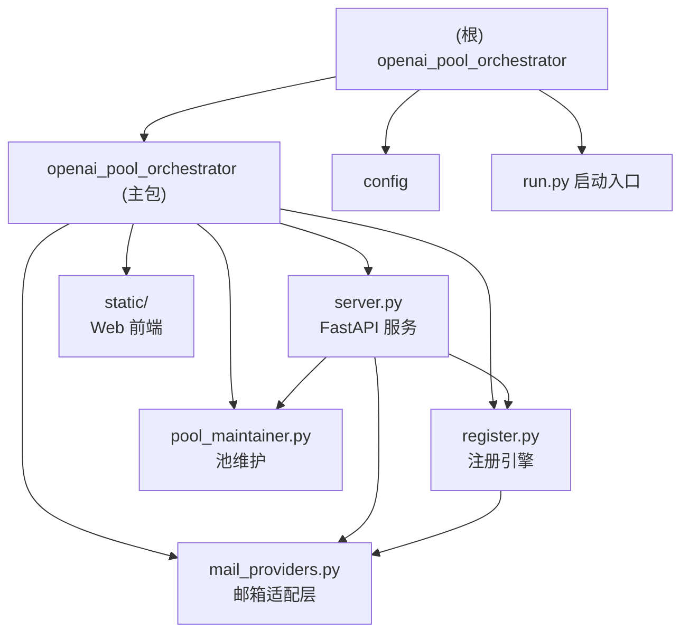

# OpenAI Pool Orchestrator

## 项目愿景

自动化 OpenAI 账号注册、Token 管理与多平台账号池维护工具。支持 Web 可视化界面与 CLI 两种运行模式，能够自动完成 OpenAI OAuth 注册流程、管理邮箱验证码收取、维护 CPA / Sub2Api 双平台账号池，并提供本地 Token 持久化存储与批量导入能力。

## 架构总览

单体 Python 应用，后端基于 FastAPI + Uvicorn，前端为原生 HTML/CSS/JS（嵌入式 SPA）。核心业务分为三大模块：注册引擎、邮箱提供商适配层、账号池维护器。通过 SSE（Server-Sent Events）实现前后端实时日志推送与任务状态同步。

**技术栈**：Python 3.10+ / FastAPI / Uvicorn / curl-cffi / aiohttp / requests
**版本**：v2.0.0（pyproject.toml）/ 前端 v5.2.1（index.html）
**协议**：MIT
**运行端口**：18421

```
openai_pool_orchestrator/          -- 项目根目录
|-- run.py                         -- 快捷启动脚本（Web 或 CLI 模式）
|-- pyproject.toml                 -- 项目元数据与依赖
|-- requirements.txt               -- pip 依赖锁定
|-- Dockerfile                     -- Docker 构建文件
|-- docker-compose.yml             -- Docker Compose 编排
|-- AGENTS.md                      -- Codex/Agent 使用指南
|-- config/
|   `-- sync_config.example.json   -- 配置模板
|-- openai_pool_orchestrator/      -- 主包
|   |-- __init__.py                -- 包初始化、路径常量
|   |-- __main__.py                -- python -m 入口、Uvicorn 启动
|   |-- server.py                  -- FastAPI 服务、全部 REST API + SSE
|   |-- register.py                -- OpenAI OAuth 注册引擎（核心业务逻辑）
|   |-- pool_maintainer.py         -- CPA / Sub2Api 双平台池维护
|   |-- mail_providers.py          -- 邮箱提供商抽象层（4 种实现）
|   `-- static/
|       |-- index.html             -- Web UI 主页面
|       |-- app.js                 -- 前端交互逻辑
|       `-- style.css              -- iOS Flat Design 样式
`-- data/                          -- 运行时数据（.gitignore 排除）
    |-- sync_config.json           -- 实际运行配置
    |-- state.json                 -- 成功/失败计数持久化
    `-- tokens/                    -- 注册获取的 Token 文件
```

## 模块结构图



## 模块索引

| 模块路径 | 语言 | 职责 | 入口文件 | 代码行数(估) | 测试 |
|----------|------|------|---------|-------------|------|
| `openai_pool_orchestrator/` | Python | 核心业务包（注册、服务、池维护、邮箱） | `__init__.py` / `__main__.py` | ~5800+ | 无 |
| `openai_pool_orchestrator/static/` | HTML/CSS/JS | Web 可视化界面 | `index.html` | ~2500+ | 无 |
| `config/` | JSON | 配置模板 | `sync_config.example.json` | 55 | N/A |

## 运行与开发

### 安装依赖

```bash
pip install -r requirements.txt
pip install -e .           # 可编辑安装，注册 openai-pool 命令
```

### 启动方式

```bash
# Web 服务模式（推荐）
python run.py
# 访问 http://localhost:18421

# 模块方式启动
python -m openai_pool_orchestrator

# CLI 单次注册
python run.py --cli --proxy http://127.0.0.1:7897 --once

# Docker
docker compose up -d
```

### 配置

1. 复制 `config/sync_config.example.json` 为 `data/sync_config.json`
2. 在 Web UI 配置中心或直接编辑 JSON 填入敏感信息（代理、平台地址、Token、邮箱提供商配置）
3. 运行时数据持久化到 `data/` 目录

### Docker 部署

```bash
docker compose up -d
# 数据卷映射：/opt/openai-pool/data -> /app/data, /opt/openai-pool/config -> /app/config
# 使用 host 网络模式，端口 18421
```

### 语法检查

```bash
python -m compileall openai_pool_orchestrator
```

## 测试策略

**当前状态**：项目尚未建立测试套件。

**建议**：
- 测试目录：`tests/`，文件命名 `test_*.py`
- 运行：`python -m pytest`
- 优先覆盖：注册异常路径、邮箱提供商切换与容错、关键 API 端点行为、池维护逻辑

## 编码规范

- Python 3.10+ 语法，遵循 PEP 8，4 空格缩进
- 命名：模块/函数/变量 `snake_case`，类 `PascalCase`，常量 `UPPER_SNAKE_CASE`
- `server.py` 路由处理保持简洁，可复用逻辑下沉到独立模块
- 前端保持原生 JS/CSS，轻量修改
- 不提交密钥、Token 或 `data/` 下运行态文件
- Conventional Commits 格式：`feat: 增加邮箱超时重试`

## API 概览

FastAPI 服务提供 40+ REST API 端点，主要分组：

| 分组 | 端点前缀 | 功能 |
|------|---------|------|
| 任务控制 | `POST /api/start`, `/api/stop` | 启停注册任务 |
| 代理管理 | `/api/proxy`, `/api/check-proxy`, `/api/proxy-pool/*` | 代理配置、检测、代理池 |
| 配置管理 | `/api/sync-config`, `/api/pool/config`, `/api/mail/config` | 同步配置、池配置、邮箱配置 |
| Token 管理 | `/api/tokens`, `/api/sync-now`, `/api/sync-batch` | 本地 Token CRUD、批量导入 |
| CPA 池 | `/api/pool/*` | CPA 状态、探测、维护、自动维护 |
| Sub2Api 池 | `/api/sub2api/*` | Sub2Api 账号列表、探测、删除、维护、去重 |
| 实时日志 | `GET /api/logs` (SSE) | 结构化 SSE 事件流 |
| 上传策略 | `POST /api/upload-mode` | 串行补平台 / 双平台同传 |

## AI 使用指引

- 核心业务逻辑集中在 `register.py`（~1600 行）和 `server.py`（~3500 行），修改前请仔细理解上下文
- `server.py` 中 `TaskState` 类管理全局任务状态与多 Worker 运行时快照
- 邮箱提供商通过 `MailProvider` 抽象基类 + 工厂模式扩展，新增提供商需实现 `create_mailbox()` 和 `wait_for_otp()`
- 池维护器分 `PoolMaintainer`（CPA）和 `Sub2ApiMaintainer`（Sub2Api），各自独立
- 配置通过内存 + `data/sync_config.json` 双层持久化，读写有锁保护
- 前端通过 SSE 接收结构化事件（`task_snapshot`、`runtime_snapshot`、`stats`、`log` 等）

## 变更记录 (Changelog)

| 时间 | 操作 | 说明 |
|------|------|------|
| 2026-03-18 09:19:57 | 初始扫描 | 首次生成 CLAUDE.md，覆盖全部源文件 |
